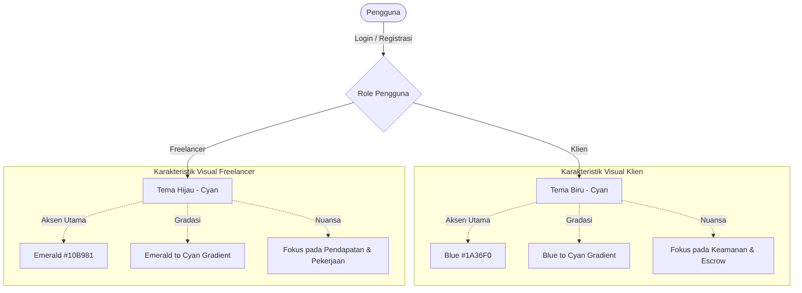

# FreeTrack Design System Manual Book

Dokumen ini berisi panduan desain lengkap (**Design Manual Book**) untuk platform **FreeTrack**. Panduan ini dirancang untuk memastikan konsistensi visual, estetika premium, dan pengalaman pengguna yang interaktif baik dalam aplikasi, dokumentasi digital, maupun media publikasi lainnya.

---

## 1. Konsep & Filosofi Desain

FreeTrack mengusung tema **Cyber-Navy & Emerald Glassmorphism**. Desain ini menggabungkan kedalaman warna biru gelap (*Navy*) dengan kesegaran warna hijau zamrud (*Emerald*) dan biru muda (*Cyan*), menciptakan kesan platform yang:
*   **Professional & Secure**: Membangun kepercayaan (*trust*) antara Klien dan Freelancer melalui warna biru tua yang solid.
*   **Modern & Premium**: Menggunakan efek kaca transparan (*glassmorphism*), gradasi warna halus, dan cahaya pendaran (*glow shadow*) untuk estetika kelas atas.
*   **Interactive & Alive**: Dilengkapi dengan mikro-animasi (floating, pulse, slide-up) untuk merespons setiap tindakan pengguna dengan halus.

---

## 2. Sistem Warna (Color Palette)

Warna pada FreeTrack dikelompokkan ke dalam warna dasar latar belakang, warna brand, gradasi, dan warna status.

### 2.1 Warna Utama (Core Colors)

| Kategori | Nama Variabel | Kode HEX | Representasi Visual / Penggunaan |
| :--- | :--- | :--- | :--- |
| **Latar Belakang** | `--background` | `#0A0F1E` | Latar belakang dasar aplikasi (Sangat Gelap / Navy Deep). |
| **Teks Utama** | `--foreground` | `#E2E8F0` | Warna teks utama agar kontras tinggi dengan latar belakang. |
| **Navy Utama** | `--navy` | `#0D1B3E` | Warna latar belakang card, modal, atau sidebar. |
| **Navy Terang** | `--navy-light` | `#162550` | Warna border, state hover, atau kontainer sekunder. |
| **Navy Gelap** | `--navy-deep` | `#060D20` | Warna header, footer, atau area scrollbar track. |
| **Primary (Blue)** | `--primary` | `#1A36F0` | Warna tombol utama Klien, tautan aktif, dan penanda fokus. |
| **Primary Light** | `--primary-light` | `#4D63FF` | Variasi hover atau state aktif untuk elemen Klien. |
| **Accent (Emerald)**| `--accent` | `#10B981` | Warna tombol utama Freelancer, status disetujui, dan elemen sukses. |
| **Accent Light** | `--accent-light` | `#34D399` | Variasi hover atau penanda teks untuk elemen Freelancer. |
| **Cyan** | `--cyan` | `#06B6D4` | Warna aksen sekunder untuk gradasi dan grafik statistik. |
| **Cyan Light** | `--cyan-light` | `#22D3EE` | Aksen teks terang, ikon, dan penyorotan (*highlight*). |
| **Warning** | `--warning` | `#F59E0B` | Status menunggu pembayaran DP, pending, atau peringatan. |
| **Danger** | `--danger` | `#EF4444` | Status kontrak ditolak, pembatalan, atau pesan error. |

### 2.2 Gradasi Warna (Gradients)

Gradasi digunakan untuk memberikan sentuhan premium pada teks judul (*gradient text*), tombol pemicu utama (*call-to-action*), dan dekorasi latar belakang.

*   **Primary Gradient (Blue to Cyan)**
    *   *CSS*: `linear-gradient(135deg, #1A36F0 0%, #06B6D4 100%)`
    *   *Penggunaan*: Tombol Klien, judul landing page, aksen visual Klien.
*   **Emerald Gradient (Emerald to Cyan)**
    *   *CSS*: `linear-gradient(135deg, #10B981 0%, #06B6D4 100%)`
    *   *Penggunaan*: Tombol Freelancer, judul fitur sukses, badge penyelesaian.
*   **Hero Ambient Gradient (Radial)**
    *   *CSS*:
        ```css
        radial-gradient(ellipse at 30% 20%, rgba(26,54,240,0.15) 0%, transparent 50%),
        radial-gradient(ellipse at 70% 80%, rgba(16,185,129,0.1) 0%, transparent 50%)
        ```
    *   *Penggunaan*: Pendaran latar belakang di Landing Page untuk memberi ilusi kedalaman ruang.

---

## 3. Tipografi & Hierarki Teks

FreeTrack menggunakan jenis font tunggal yang modern dan bersih untuk menjaga keterbacaan tinggi di berbagai resolusi layar.

*   **Font Family**: `'Inter', system-ui, sans-serif` (Dihubungkan melalui Google Fonts).
*   **Hierarki Ukuran & Ketebalan**:
    *   **H1 (Hero Title)**: `48px` - `64px` | Bold / Extra Bold (`font-weight: 800`) | Letter spacing: `-1px`.
    *   **H2 (Section Title)**: `32px` - `36px` | Bold (`font-weight: 700`) | Letter spacing: `-0.5px`.
    *   **H3 (Card Title)**: `20px` - `24px` | Semi Bold (`font-weight: 600`).
    *   **Body Text (Teks Konten)**: `15px` - `16px` | Regular (`font-weight: 400`) | Line height: `1.6`.
    *   **Muted Text / Labels**: `13px` - `14px` | Medium (`font-weight: 500`) | Color: Slate Muted.

---

## 4. Efek Visual, Tekstur, dan Bayangan

Untuk memperkuat estetika **Cyber-Navy**, elemen antarmuka menggunakan teknik perpaduan kaca transparan dan bayangan berpendar.

### 4.1 Efek Kaca (Glassmorphism)
Elemen seperti kartu informasi (*Card*) dan popup modal menggunakan efek *Glassmorphism* dengan spesifikasi berikut:
*   **Background**: `rgba(13, 27, 62, 0.5)`
*   **Border**: `1px solid rgba(255, 255, 255, 0.06)`
*   **Backdrop Blur**: `blur(16px)`
*   **Efek Hover**:
    *   Ubah background menjadi `rgba(13, 27, 62, 0.7)`.
    *   Ubah warna border menjadi `rgba(26, 54, 240, 0.25)`.
    *   Berikan bayangan berpendar biru lembut.

### 4.2 Tekstur Latar Belakang (Noise & Grid)
*   **Grid Background (`.grid-bg`)**: Pola garis grid transparan dengan ukuran kotak `64px x 64px` menggunakan warna biru redup (`rgba(26, 54, 240, 0.03)`).
*   **Noise Overlay (`.noise-overlay`)**: Tekstur butiran halus (*noise svg*) dengan opasitas `0.02` yang dipasang secara statis di atas seluruh halaman untuk memberikan nuansa analog/cyberpunk yang premium.

### 4.3 Sistem Bayangan & Pendaran (Shadow & Glow)
*   **Shadow Glow Primary**: `0 0 40px rgba(26, 54, 240, 0.25)` (Pendaran biru untuk Klien/fitur utama).
*   **Shadow Glow Emerald**: `0 0 40px rgba(16, 185, 129, 0.2)` (Pendaran hijau untuk Freelancer/sukses).
*   **Card Shadow**: `0 8px 32px rgba(0, 0, 0, 0.3)` (Bayangan hitam pekat di bawah glass card).
*   **Elevated Shadow**: `0 24px 80px rgba(0, 0, 0, 0.5)` (Digunakan untuk modal yang melayang).

---

## 5. Bahasa Animasi (Animation & Motion Design)

Gerakan dalam FreeTrack tidak hanya dekoratif, melainkan berfungsi sebagai petunjuk interaksi pengguna (*micro-interactions*).

*   **Floating Effect (`.animate-float`)**:
    *   *Gerakan*: Naik turun sejauh `14px` dengan durasi `6 detik` secara melingkar (*ease-in-out infinite*).
    *   *Penggunaan*: Elemen ilustrasi, ikon pemicu, atau mockup visual di hero section.
*   **Floating Slow Effect (`.animate-float-slow`)**:
    *   *Gerakan*: Naik turun `8px` dengan sedikit rotasi `1 derajat` durasi `8 detik`.
    *   *Penggunaan*: Piringan dekoratif belakang (*orbs*) agar latar belakang terasa dinamis.
*   **Pulse Glow (`.animate-pulse-glow`)**:
    *   *Gerakan*: Pendaran warna hijau-emerald yang meredup dan menyala secara berkala (durasi `3 detik`).
    *   *Penggunaan*: Indikator milestone aktif atau tombol konfirmasi pembayaran.
*   **Slide Up (`.animate-slide-up`)**:
    *   *Gerakan*: Muncul dari bawah setinggi `30px` menuju `0px` dibarengi transisi opacity dari `0` ke `1` (durasi `0.7 detik`).
    *   *Penggunaan*: Transisi antar-halaman dashboard atau penampilan form langkah onboarding.

---

## 6. Panduan Komponen Antarmuka (UI Components)

### 6.1 Tombol (Buttons)

Tombol dirancang dengan transisi melayang (*translate Y*) dan penambahan intensitas bayangan saat disentuh cursor (*hover*).

1.  **Button Primary (Klien / Umum)**
    *   *Style*: Gradasi Biru ke Cyan, sudut melengkung `12px` (*border-radius*), teks tebal, warna teks putih.
    *   *Hover*: Geser ke atas `2px`, bayangan pendaran biru berpiksel besar.
2.  **Button Emerald (Freelancer / Sukses)**
    *   *Style*: Gradasi Hijau ke Cyan, border-radius `12px`, teks tebal, warna teks putih.
    *   *Hover*: Geser ke atas `2px`, bayangan pendaran hijau berpiksel besar.
3.  **Button Secondary (Batal / Pilihan Kedua)**
    *   *Style*: Transparan, border abu-abu transparan `rgba(255,255,255,0.12)`, warna teks slate.
    *   *Hover*: Border berubah menjadi emerald, background tipis hijau `rgba(16,185,129,0.08)`, geser ke atas `2px`.

### 6.2 Lencana Bagian (Section Badge)
Untuk melabeli bagian konten kecil di atas judul utama:
*   *Style*: Latar belakang hijau transparan `rgba(16,185,129,0.08)`, border tipis hijau `rgba(16,185,129,0.2)`, warna teks hijau terang (`--accent-light`), teks kapital dengan jarak antar huruf lebar, sudut melingkar sempurna (*pill shape*).

### 6.3 Desain Modal Kustom (SweetAlert2 Custom Theme)
Modal notifikasi menggunakan SweetAlert2 dengan modifikasi agar melebur dengan tema FreeTrack:
*   **Popup**: Warna navy transparan `rgba(15, 25, 45, 0.95)`, blur kaca `20px`, border putih tipis `rgba(255,255,255,0.08)`.
*   **Teks Judul**: Warna putih solid, font-weight `800`.
*   **Tombol Konfirmasi**: Mengikuti *Primary Gradient* dengan sudut `12px`, tanpa border.

---

## 7. Desain Khusus Berdasarkan Peran (Role-Based Design)

Salah satu aspek terpenting dari FreeTrack adalah perbedaan tema visual yang halus untuk membedakan dashboard Klien dan Freelancer secara psikologis.



### 7.1 Dashboard Klien
*   **Warna Dominan**: Gradasi Biru-Cyan (`--gradient-primary`).
*   **Tujuan Visual**: Menampilkan kestabilan, kontrol anggaran, dan pengelolaan proyek.
*   **Aksen Khusus**: Tombol-tombol penting menggunakan warna biru terang. Statistik berfokus pada progres milestone dan status dana escrow.

### 7.2 Dashboard Freelancer
*   **Warna Dominan**: Gradasi Hijau-Cyan (`--gradient-emerald`).
*   **Tujuan Visual**: Menampilkan pertumbuhan karir, kemudahan klaim pendapatan, dan manajemen pengerjaan tugas.
*   **Aksen Khusus**: Tombol-tombol penting menggunakan warna hijau emerald. Statistik berfokus pada total pendapatan terkumpul dan milestone yang siap diklaim.

---

## 8. Penerapan pada Buku Panduan (Manual Book Template)

Jika Anda ingin membuat manual book fisik atau dokumen PDF terpisah, ikuti panduan layout berikut agar memiliki gaya yang serupa dengan antarmuka web FreeTrack:

### 8.1 Layout Dokumen & Warna Halaman
*   **Halaman Sampul (Cover Page)**:
    *   *Warna Latar Belakang*: Navy Gelap (`#0A0F1E`).
    *   *Judul*: Ukuran besar, menggunakan gradasi warna biru ke cyan (atau hijau ke cyan tergantung target pengguna).
    *   *Elemen Grafis*: Tambahkan ornamen garis kisi (*grid*) transparan di bagian belakang cover.
*   **Halaman Isi**:
    *   *Warna Latar*: Putih Bersih atau Abu-abu Sangat Terang (`#F8FAFC`) untuk versi cetak, agar mudah dibaca dan hemat tinta. 
    *   *Aksen Pembatas*: Gunakan garis tipis berwarna biru tua (`#0D1B3E`) untuk pembatas bab, dan aksen warna hijau emerald (`#10B981`) untuk penanda bagian penting.

### 8.2 Kotak Catatan & Peringatan (Alert Callouts)
Gunakan format kotak visual berikut pada dokumen Anda:

> [!NOTE]
> **INFO PLATFORM**
> Latar belakang kotak abu-abu/biru muda. Digunakan untuk memberikan tips operasional platform FreeTrack.

> [!IMPORTANT]
> **PENTING UNTUK DIINGAT**
> Latar belakang bergaris biru tebal. Digunakan untuk menjelaskan aturan kontrak digital atau detail rincian milestone.

> [!WARNING]
> **KEAMANAN & PEMBAYARAN**
> Latar belakang bergaris jingga/amber (`#F59E0B`). Digunakan untuk instruksi pembayaran DP Milestone sebelum freelancer memulai pengerjaan proyek.

---

*Panduan desain ini dibuat untuk menjaga integritas visual FreeTrack tetap premium, konsisten, dan memikat di semua media.*
