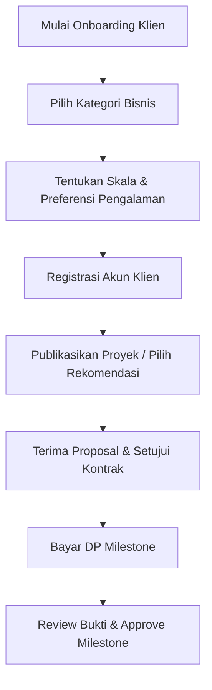
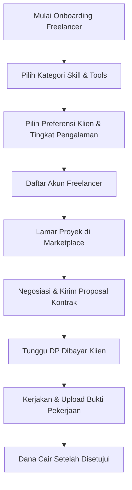

# Buku Panduan Pengguna FreeTrack (User Manual Book)

Selamat datang di **FreeTrack**, platform manajemen kerja lepas (*freelance*) modern yang menghubungkan **Klien** dan **Freelancer** melalui sistem kontrak digital transparan, milestone terstruktur, dan perlindungan pembayaran DP yang aman.

Buku panduan ini dirancang untuk membantu Klien dan Freelancer memahami seluruh fitur, alur kerja (*flow*), serta cara berinteraksi di dalam platform FreeTrack.

---

## Daftar Isi

1. [Panduan untuk Klien (Client Guide)](#1-panduan-untuk-klien-client-guide)
   - Onboarding & Pemilihan Preferensi
   - Membuat & Mempublikasikan Proyek
   - Menemukan Freelancer Terbaik
   - Meninjau & Menyetujui Kontrak Digital
   - Pembayaran DP Milestone & Escrow
   - Persetujuan Pekerjaan & Pelepasan Dana
2. [Panduan untuk Freelancer (Freelancer Guide)](#2-panduan-untuk-freelancer-freelancer-guide)
   - Setup Profil & Skill Onboarding
   - Mencari Proyek di Marketplace
   - Mengirim Proposal Lamaran
   - Melakukan Inisiasi Kontrak Baru
   - Mengelola Milestone & Mengunggah Bukti Kerja
   - Mengajukan Permintaan Perubahan (Scope Creep Guard)
3. [Panduan Lifecycle & Status Kontrak](#3-panduan-lifecycle--status-kontrak)
4. [FAQ & Penyelesaian Masalah](#4-faq--penyelesaian-masalah)

---

## 1. Panduan untuk Klien (Client Guide)

Sebagai Klien, Anda dapat mempekerjakan talenta profesional dengan jaminan keamanan pembayaran melalui sistem milestone escrow kami.



### 1.1 Onboarding & Pemilihan Preferensi
1. Buka halaman utama FreeTrack dan klik **"Mulai Sekarang"**.
2. Pilih jalur **Klien**.
3. **Step 1 (Kategori)**: Pilih minimal satu kategori industri bisnis Anda (misal: *Tech, Creative, Writing*).
4. **Step 2 (Preferensi)**: Tentukan skala bisnis Anda, tipe kerjasama (kontrak, per jam, dst.), dan tingkat pengalaman freelancer yang dicari.
5. **Step 3 (Auth Gate)**: Klik **"Daftar"** untuk melanjutkan ke form pembuatan akun atau **"Masuk"** jika sudah memiliki akun.

### 1.2 Membuat & Mempublikasikan Proyek
1. Masuk ke Dashboard Klien, pilih menu **Proyek** lalu klik **"+ Posting Proyek"**.
2. Lengkapi detail proyek:
   - Judul, kategori, deskripsi detail, anggaran, tenggat waktu.
   - **Screening Questions**: Buat pertanyaan penyaringan wajib dijawab oleh freelancer untuk memvalidasi kualifikasi mereka.
3. Simpan sebagai **Published** agar proyek tampil di marketplace publik.

> [!NOTE]
> Anda juga dapat menyimpan proyek sebagai *Draft* jika belum siap mempublikasikannya secara luas.

### 1.3 Menemukan Freelancer Terbaik & Menawarkan Proyek
Sistem FreeTrack menyediakan tiga metode utama untuk merekrut freelancer:
*   **Cari Freelancer (Direktori Talenta)**: Buka menu **Cari Freelancer** untuk menjelajahi daftar talenta terdaftar berdasarkan kota, negara, ketersediaan, serta tarif yang sesuai. Klik profil freelancer untuk melihat detail spesialisasi, rating, ulasan klien lain, portofolio, dan tarif/jam mereka. Anda dapat menekan **"Mulai Diskusi"** untuk terhubung via obrolan chat.
*   **Auto-Matching (Rekomendasi Otomatis)**: Pada halaman utama dashboard Klien, sistem menampilkan kartu rekomendasi freelancer berdasarkan kecocokan preferensi onboarding Anda. Klik **"Mulai Diskusi"** untuk membuka ruang chat secara otomatis.
*   **Review Proposal Pelamar**: Buka proyek Anda untuk melihat daftar proposal masuk dari freelancer. Anda dapat melihat lampiran, jawaban pertanyaan penyaringan (*screening answers*), dan *Cover Letter* mereka.

Setelah terhubung melalui obrolan chat (dari Cari Freelancer atau Rekomendasi), Anda dapat langsung menawarkan proyek:
1. Buka ruang chat dengan freelancer tersebut.
2. Klik tombol **"Tawarkan Proyek"** di pojok kanan atas obrolan.
3. Pilih proyek Anda yang berstatus **Draf** atau **Terpublikasi** (dan belum ada freelancer lain yang ditugaskan).
4. Klik **"Kirim Penawaran"**. Status proyek akan berubah menjadi **Pending Freelancer** dan freelancer akan menerima proposal di sisi mereka.

### 1.4 Meninjau & Menyetujui Kontrak Digital
Setelah Anda bersepakat dengan freelancer via chat, freelancer akan membuat proposal kontrak digital.
1. Anda akan menerima notifikasi kontrak masuk di dalam dashboard.
2. Buka **Contract Review Modal** untuk memeriksa detail rincian milestone, estimasi durasi proyek, total biaya, dan deliverables.
3. Klik **"Setujui Kontrak"** untuk mengunci kontrak dan memulai pengerjaan, atau klik **"Kembalikan / Revisi"** jika ada klausul yang perlu direvisi freelancer.

### 1.5 Pembayaran DP Milestone & Escrow
Sebelum freelancer memulai pengerjaan milestone pertama, Anda harus melakukan deposit (Down Payment/DP).

> [!IMPORTANT]
> **PENTING UNTUK KEAMANAN**
> FreeTrack menggunakan sistem Escrow. Uang DP yang Anda bayar akan disimpan dengan aman oleh sistem FreeTrack dan **tidak langsung dikirim ke freelancer** sampai mereka menyelesaikan pekerjaan dan Anda menyetujuinya.

1. Buka menu **Milestone** (`/dashboard/milestones`).
2. Cari milestone berstatus **"Menunggu DP"** (ditandai dengan warna kuning).
3. Klik tombol **"Bayar DP Sekarang"** untuk dialihkan ke halaman pembayaran.
4. Setelah pembayaran berhasil, status milestone otomatis berubah menjadi **"In Progress"** dan freelancer dapat mulai mengunggah hasil kerja.

### 1.6 Persetujuan Pekerjaan & Pelepasan Dana
1. Ketika freelancer menyelesaikan tahapan milestone, mereka akan mengunggah berkas atau tautan bukti penyelesaian.
2. Status milestone akan berubah menjadi **"Menunggu Persetujuan"**.
3. Klik **"Review Submission"** untuk memeriksa hasil kerja mereka.
4. Jika hasil kerja sesuai: Klik **"Approve"**. Sistem akan otomatis melepaskan dana escrow ke saldo freelancer dan mengubah status milestone menjadi **"Disetujui"**.
5. Jika hasil kerja perlu perbaikan: Klik **"Tolak / Minta Revisi"** agar status kembali menjadi **"In Progress"**.

---

## 2. Panduan untuk Freelancer (Freelancer Guide)

Sebagai Freelancer, Anda dapat menawarkan jasa, mengelola rincian progres tugas secara transparan, dan terhindar dari pengerjaan tanpa bayaran (*scope creep*).



### 2.1 Setup Profil & Skill Onboarding
1. Masuk ke `/onboarding` dan pilih role **Freelancer**.
2. **Step 1 (Skills)**: Pilih keahlian utama Anda (misal: *React.js, Figma, Node.js*).
3. **Step 2 (Preferences)**: Tentukan jenis proyek, tipe kolaborasi, dan skala bisnis klien yang Anda sukai.
4. **Step 3 (Profile)**: Pilih tingkat keahlian Anda (Junior/Mid/Senior) dan lama pengalaman kerja.
5. **Step 4 (Auth Gate)**: Klik **"Daftar"** untuk mendaftarkan akun Anda secara resmi.

### 2.2 Mencari Proyek di Marketplace
1. Buka menu **Marketplace** (`/dashboard/marketplace`).
2. Gunakan tab filter:
   - **Semua Proyek**: Menampilkan seluruh lowongan aktif.
   - **Sesuai Keahlian**: Menampilkan proyek dengan tingkat kecocokan minimal 50% berdasarkan skill onboarding Anda.
   - **Tersimpan**: Proyek yang Anda tandai untuk dilamar nanti.

### 2.3 Mengirim Proposal Lamaran
1. Klik salah satu kartu proyek di marketplace untuk melihat detail kebutuhan klien.
2. Klik tombol **"Ajukan Lamaran"**.
3. Tulis *Cover Letter* yang menjelaskan mengapa Anda adalah orang terbaik untuk proyek ini.
4. Jawab pertanyaan penyaringan yang diajukan oleh klien.
5. Klik **"Kirim Lamaran"**. Pesan otomatis akan terkirim ke Klien untuk membuka ruang diskusi chat.

> [!NOTE]
> Sistem FreeTrack mengisolasi lamaran Anda secara aman. Anda dapat melamar proyek yang sama dengan freelancer lain tanpa khawatir data negosiasi atau penawaran harga Anda terlihat oleh kompetitor.

### 2.4 Melakukan Inisiasi Kontrak Baru
Setelah bernegosiasi via chat dan sepakat mengenai pengerjaan proyek, Anda selaku freelancer harus menginisiasi draf kontrak resmi.
1. Buka halaman detail proyek negosiasi, klik **"Inisiasi Kontrak"**.
2. Isi draf kontrak (3 Langkah):
   - **Step 1 (Pendahuluan)**: Tulis ringkasan pendekatan kerja dan deliverables final.
   - **Step 2 (Milestone)**: Tentukan tahapan pengerjaan (klik *"+ Tambah Milestone"*, isi judul, nominal IDR, tenggat waktu, dan deskripsi).
   - **Step 3 (Timeline)**: Tinjau total anggaran dan skema persentase pembayaran (DP & termin).
3. Klik **"Kirim Proposal Kontrak"**. Kontrak akan dikirim ke Klien untuk ditinjau.

### 2.5 Mengelola Milestone & Mengunggah Bukti Kerja
1. Pastikan status milestone telah berubah menjadi **"In Progress"** (artinya Klien telah menyetor DP). Jangan mulai bekerja jika status masih "Menunggu DP".
2. Setelah pengerjaan selesai, buka menu **Milestones** di dashboard Anda.
3. Klik tombol **"Upload Bukti"** di milestone terkait.
4. Masukkan tautan (misal Google Drive, Github, Figma link) atau unggah dokumen pendukung hasil kerja Anda, lalu klik **"Kirim"**.
5. Tunggu klien meninjau. Jika disetujui, dana akan masuk ke saldo akun Anda.

### 2.6 Mengajukan Permintaan Perubahan (Scope Creep Guard)
Jika selama pengerjaan proyek Klien meminta penambahan fitur di luar kontrak awal:
1. Buka dashboard Anda, cari kartu **"Scope Creep Terdeteksi?"**.
2. Klik **"Ajukan Permintaan Perubahan"** untuk membuka `ChangeRequestModal`.
3. Tulis penambahan kerja yang diminta, serta nominal biaya tambahan yang diperlukan.
4. Kirim ke Klien agar rincian kontrak awal disesuaikan secara transparan.

---

## 3. Panduan Lifecycle & Status Kontrak

Memahami alur status di FreeTrack membantu Anda mengetahui langkah apa yang harus diambil selanjutnya.

### 3.1 Status Siklus Kontrak
*   `pending`: Kontrak baru diinisiasi oleh Freelancer, menunggu persetujuan Klien.
*   `approved` / `active`: Kontrak disetujui Klien. Pengerjaan proyek dimulai.
*   `rejected`: Kontrak ditolak oleh Klien untuk direvisi kembali oleh Freelancer.

### 3.2 Status Siklus Milestone
```
[Drafted / Contract Pending] ──(Kontrak Disetujui)──> [Menunggu DP] ──(Klien Bayar DP)──> [In Progress]
                                                                                              │
[Disetujui / Selesai] <──(Klien Approve)── [Menunggu Persetujuan] <──(Freelancer Upload Bukti)┘
                                                   │
                                            (Klien Tolak Revisi) ─────────────────────────────┘
```

---

## 4. FAQ & Penyelesaian Masalah

### Q: Mengapa saya tidak bisa mengunggah bukti pengerjaan milestone?
*   **Jawab**: Pastikan status milestone tersebut adalah **"In Progress"**. Jika statusnya masih **"Menunggu DP"**, tombol unggah bukti akan dikunci. Hubungi Klien Anda untuk melakukan pembayaran DP terlebih dahulu agar pengerjaan dapat dimulai secara sah.

### Q: Apakah Klien bisa langsung membatalkan proyek yang sedang berjalan?
*   **Jawab**: Tidak bisa. Kontrak yang sudah berstatus `approved` akan terkunci (`locked = true`). Segala bentuk pembatalan atau perubahan lingkup pekerjaan harus melalui pengajuan perubahan resmi (*Change Request*) agar disetujui bersama.

### Q: Bagaimana jika Klien tidak merespons unggahan bukti pengerjaan saya?
*   **Jawab**: Anda dapat menggunakan menu **Pesan** di dashboard untuk mengirim pengingat langsung ke Klien. Jika Klien tetap tidak ada respons dalam batas waktu yang ditentukan, hubungi tim dukungan FreeTrack untuk penengahan escrow.

---

*Manual Book FreeTrack - Pembaruan Terakhir Juni 2026.*
