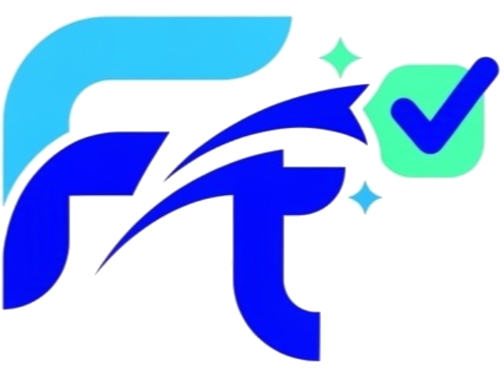

# FreeTrack - Project Governance Platform

  

**FreeTrack** adalah platform *project governance* revolusioner yang dirancang khusus untuk freelancer mahasiswa dan profesional muda di Indonesia. Kami hadir untuk memberikan kepastian kerja dan transparansi pembayaran, sehingga Anda bisa fokus pada karya terbaik Anda tanpa rasa takut.

## 🚀 Mengapa FreeTrack?

Banyak freelancer muda di Indonesia sering menghadapi masalah klasik seperti:
- **Scope Creep**: Klien tiba-tiba meminta banyak fitur tambahan tanpa bayar ekstra.
- **Masalah Pembayaran**: Proyek selesai, tapi klien *ghosting* atau pembayaran tertunda berbulan-bulan.
- **Kurangnya Kontrak**: Kerjasama hanya berdasarkan rasa percaya tanpa dokumentasi legal yang kuat.

FreeTrack hadir untuk mengakhiri masalah tersebut dengan sistem tata kelola proyek yang cerdas.

## ✨ Fitur Utama

### 1. Milestone Planning (Tahapan Jelas)
Jangan biarkan proyek menggantung tanpa ujung. Pecah proyek Anda menjadi beberapa tahapan (milestone) dengan deadline dan harga yang spesifik. Freelancer bekerja per tahapan, Klien membayar per keberhasilan.

### 2. Smart Milestone & Change Request (Anti Scope Creep)
FreeTrack mendukung dinamika kerja freelancer dengan memberikan kontrol penuh bagi Freelancer untuk menyusun rincian milestone dan harga secara mandiri. Setiap penambahan fitur di luar kontrak (*Change Request*) akan melalui mekanisme negosiasi dan tinjauan (*Review*) oleh klien. Kontrak dianggap sah dan pengerjaan dimulai hanya setelah klien melakukan *Approval Digital* pada draf yang diajukan.

### 3. Sistem Escrow (Rekening Bersama) via Midtrans
Keamanan finansial terjamin melalui integrasi Midtrans sebagai penjamin. Dana dari klien akan masuk ke akun penampungan FreeTrack sebagai jaminan komitmen sebelum pengerjaan dimulai. Dana tetap aman di saldo sistem selama proyek berstatus *In-Progress* dan akan otomatis ditransfer ke rekening Freelancer melalui layanan *Midtrans Payouts (Iris)* segera setelah klien menekan tombol *Approve* pada milestone yang diselesaikan.

### 4. Auto-Invoicing & Dokumentasi
Lupakan pembuatan invoice manual di Canva. Setiap milestone yang selesai akan men-generate invoice PDF profesional secara otomatis. Riwayat pekerjaan dan pembayaran tersimpan rapi sebagai bukti portofolio Anda.

### 5. Auto-Approve Policy
Klien lama memberi respons? Jangan khawatir. Sistem *Auto-Approve* kami akan mencairkan dana secara otomatis jika tidak ada ulasan dari klien dalam jangka waktu tertentu, sehingga arus kas freelancer tetap lancar.

## 🛠️ Teknologi yang Digunakan

- **Frontend**: [Next.js](https://nextjs.org/) (App Router) dengan TypeScript.
- **Backend & Auth**: [Supabase](https://supabase.com/).
- **Styling**: Vanilla CSS dengan desain modern premium.
- **Icons**: [Lucide React](https://lucide.dev/).
- **Notifications**: [SweetAlert2](https://sweetalert2.github.io/).

