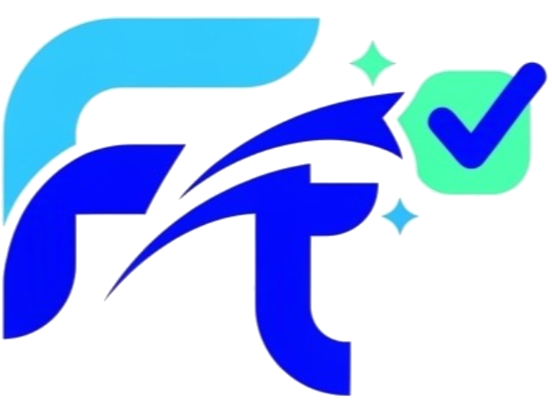

  

# 🚀 FreeTrack: Workspace Profesional untuk Masa Depan Kerja Lepas

FreeTrack adalah platform manajemen proyek inovatif yang dirancang khusus untuk membangun ekosistem kerja lepas yang transparan, aman, dan profesional. Kami bukan sekadar alat manajemen tugas, melainkan jembatan kepercayaan antara Freelancer dan Klien.

## 💡 Alasan FreeTrack Dibuat
Dunia kerja lepas seringkali dihantui oleh masalah klasik:
*   **Ghosting**: Klien atau Freelancer menghilang tanpa kabar di tengah proyek.
*   **Pembayaran Telat**: Ketidakpastian kapan honor akan cair setelah pekerjaan selesai.
*   **Manajemen Berantakan**: Komunikasi yang tersebar di WhatsApp, email, dan Excel tanpa struktur yang jelas.

**FreeTrack hadir untuk menyelesaikan masalah ini dengan sistem yang terstruktur dan aman.**

## 🛠️ Teknologi yang Digunakan
FreeTrack dibangun dengan stack teknologi modern untuk performa dan keamanan maksimal:
*   **Frontend**: Next.js 15+ (App Router), TypeScript, Framer Motion (Animations), Tailwind CSS.
*   **Backend & Database**: Supabase (PostgreSQL) dengan Row Level Security (RLS).
*   **Authentication**: Supabase Auth (Role-based metadata).
*   **Payment Gateway**: Integrasi Midtrans untuk pembayaran aman.
*   **Icons**: Lucide React.

## 🌟 Keunggulan Sistem FreeTrack
1.  **Negosiasi Ping-pong**: Alur negosiasi draf proyek yang transparan hingga kedua pihak sepakat.
2.  **Milestone-Based Workflow**: Proyek dipecah menjadi langkah-langkah kecil yang jelas dengan target nominal masing-masing.
3.  **Sistem Escrow & DP**: Keamanan finansial dengan pembayaran DP di muka yang ditahan sistem sebelum milestone disetujui.
4.  **Real-time Evidence Submission**: Freelancer mengunggah bukti kerja langsung ke sistem untuk divalidasi Klien.
5.  **Automated Invoicing**: Pembuatan invoice profesional secara otomatis untuk setiap transaksi.
6.  **Progress Tracking Otomatis**: Bar progres proyek yang bergerak secara real-time berdasarkan milestone yang diselesaikan.

---

# 🎙️ Master Guide: Demo FreeTrack (17 Menit)
Dokumen ini adalah panduan utama untuk demo sistem FreeTrack yang dibagi menjadi 4 sesi pitching.

## 📅 Jadwal & Pembagian Tugas
Total Durasi: **17 Menit**

| Sesi | Speaker | Topik Utama | File Pitching |
| :--- | :--- | :--- | :--- |
| 00:00 - 04:15 | **Eko Muhammad** | Vision, Onboarding Freelancer, Dashboard Overview | [ekopitching.md](file:///ekopitching.md) |
| 04:15 - 08:30 | **Fitri Haerani** | Onboarding Client, Contacts, Project Negotiation | [fitripitching.md](file:///fitripitching.md) |
| 08:30 - 12:45 | **Nailah Rasya** | Milestone Management, Evidence, Progress Tracking | [nailahpitching.md](file:///nailahpitching.md) |
| 12:45 - 17:00 | **Ghibran** | Financials, Midtrans, Invoices, Closing | [ghibranpitching.md](file:///ghibranpitching.md) |

---

## 🛠️ Persiapan Demo (Best Practices)
1.  **Gunakan Akun Dummy**: Siapkan dua browser berbeda (misal: Chrome untuk Freelancer, Edge untuk Client).
2.  **Siapkan Data**: Pastikan sudah ada proyek draf dan proyek aktif yang siap didemokan.
3.  **Koneksi Stabil**: Aplikasi menggunakan Supabase secara real-time.
4.  **No Dead Air**: Teruslah berbicara saat melakukan klik atau menunggu loading.

---
**Selamat berdemo! Mari buat FreeTrack bersinar!** 🚀
